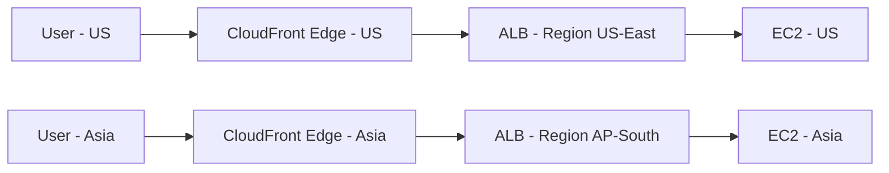

# 🌐 Global Users for Our Application — Leveraging AWS Network

## 🧭 Who Are Global Users?

Global users are **users accessing our application from different geographic locations around the world** — not just from one country or region.

These users may come from:
- Different **continents** (e.g., US, Europe, Asia)
- Various **time zones**
- Diverse **network conditions** (latency, bandwidth)

---

## 🚀 Why Design for Global Users?

To ensure:
- ✅ **Low latency** for users regardless of their location
- ✅ **High availability** and failover
- ✅ **Localized content delivery**
- ✅ **Compliance** with regional laws (e.g., GDPR)

---

## 🧰 How AWS Helps with Global User Distribution

AWS offers a suite of services to build **high-performing global apps**:

### 1. 🌍 AWS Global Infrastructure
- 30+ Regions
- 100+ Availability Zones (AZs)
- 400+ Edge Locations (CloudFront POPs)
- **AWS Backbone Network** connects regions with high-speed fiber.

### 2. 🚀 Amazon CloudFront (CDN)
- Delivers content (HTML, JS, Images, Videos) from **edge locations closest to users**
- Reduces latency and speeds up page load times
- Can cache dynamic & static content
- Supports **Geo Restriction** and **custom origin** (ALB, EC2, S3)

### 3. ⚖️ Elastic Load Balancer (Global Access)
- Application Load Balancer or Network Load Balancer can be fronted with **CloudFront**
- Distributes traffic across regions or AZs

### 4. 🧠 Route 53 (Global DNS)
- Supports **Latency-Based Routing**
- **Geo Routing**: Send user to nearest or authorized region
- **Failover Routing** for DR and high availability

### 5. ☁️ AWS Global Accelerator (for TCP/UDP apps)
- Uses AWS Global Network to route user traffic to **nearest AWS edge**
- Improves **availability and performance** for non-HTTP workloads (gaming, VoIP, etc.)
- Automatically reroutes to healthy endpoints

---

## 🗺️ Architecture for Global Users

---

## ✅ Best Practices for Supporting Global Users

- 📦 Use **CloudFront** for static and dynamic content
- 🌍 Use **Route 53 latency/geo-based routing**
- 🌐 Prefer **multi-region deployment** for mission-critical apps
- ⚙️ Monitor with **CloudWatch** and **X-Ray** for latency and failures
- 📁 Use **S3 Transfer Acceleration** for faster uploads globally

---

## 💡 Example Use Case

Your e-commerce app has:
- Users from India, Germany, and US
- Static assets (images/videos)
- API backed by microservices

You can:
1. Use **CloudFront** to cache & serve assets
2. Deploy API in **multiple regions**
3. Use **Route 53 Latency-based Routing**
4. Add **AWS Global Accelerator** for better routing performance

---

## 🧠 Summary

| Feature                  | Tool/Service             | Purpose                                    |
|--------------------------|--------------------------|---------------------------------------------|
| Global Content Delivery  | CloudFront               | Low-latency access to static/dynamic data   |
| Regional Routing         | Route 53                 | Sends user to nearest region                |
| Global App Acceleration  | AWS Global Accelerator   | Improves performance for TCP/UDP apps       |
| Availability & Redundancy| Multi-Region + ALB + ASG | Prevents regional failures                  |

---

## 📚 Further Reading

- [AWS Global Infrastructure](https://aws.amazon.com/about-aws/global-infrastructure/)
- [Amazon CloudFront](https://docs.aws.amazon.com/cloudfront/)
- [AWS Global Accelerator](https://docs.aws.amazon.com/global-accelerator/)
- [Amazon Route 53 Routing Policies](https://docs.aws.amazon.com/Route53/latest/DeveloperGuide/routing-policy.html)
